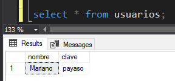

# Explorando la Sentencia INSERT

Sintaxis básica para agregar un registro de datos con `INSERT`:
```sql
insert into NOMBRETABLA (NOMBRECAMPO1, NOMBRECAMPO2, ... , NOMBRECAMPOn) values (VALORCAMPO1, VALORCAMPO2, ... , VALORCAMPOn);

--De esta forma agregamos un registro a la tabla:

insert into usuarios (nombre, clave) values ('Mariano', 'payaso');
```

Tomar en cuenta que como los datos ingresados son en cadenas de caracteres, utilizamos comillas simples.

Para ver los registros en la tabla usamos:

```sql
select * from usuarios;
```

El comando `select` recupera los registros de una tabla. Con el asterisco indicamos que muestre todos los campos de la tabla `usuarios`.



Es importante ingresar los valores en el mismo orden en el que se nombran los campos. Por ejemplo:

```sql
insert into usuarios (clave, nombre) values ('River', 'Juan');
```

En el ejemplo anterior primero se nombrará al campo `clave` y luego al campo `nombre` por eso los valores tambien se deben colocar en ese orden. Si los datos se ingresan en un orden distindo al que se nombraron los campos, no aparecerá ningun error, pero los datos estarán en los campos incorrectos.

De igual forma si queremos registrar un campo en especifico lo hariamos de la siguiente manera:

```sql
insert into nombre_tabla (nombre_campo) values ('valor_campo');

--Ejemplo:
insert into usuarios (clave) values ('River');
```

Tambien podemos insertar un registro sin especificar los campos:

```sql
insert into usuarios values ('Mariano', 'payaso');
```

Esto agregara los valores en el orden en que se crearon los campos a la hora de crear la tabla.

>[!note]
>Es importante destacar que en esta manera de insertar registros se deben agregar todos los valores de los campos o se correra el riesgo de que los valores se agreguen en campos equivocados o en caso de omitir algun campo este quedará null.