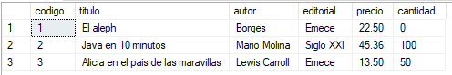

# Operadores Aritméticos y de Concatenación

Los operadores aritmeticos permiten realizar calculos con valores numericos.

`*` - Multiplicacion.
`/` - Division.
`%` - Modulo (el resto de dividir numeros enteros).
`+` - Suma.
`-` - Resta.

Es posible obtener salidas en las cuales una columna sea el resultado de un calculo y no un campo de una tabla.

```sql
select titulo, precio, precio-(precio*0.1)
    from libros;
```

Los operadores de concatenacion: permite concatenar cadenas, el más `+`.

Para concatenar el titulo, el autor y la editorial de cada libro usamos el operador de concatenacion `+`:

```sql
select titulo+'-'+autor+'-'+editorial
    from libros;
```

## Explicacion y Ejemplos

Ingresemos el siguiente lote de comandos en el SQL Server Management Studio:

```sql
if object_id('libros') is not null
    drop table libros;

create table libros(
    codigo int identity,
    titulo varchar(40) not null,
    autor varchar(20) default 'Desconocido',
    editorial varchar(20),
    precio decimal(6,2),
    cantidad tinyint default 0, primary key (codigo)
);

go

insert into libros (titulo,autor,editorial,precio)
    values('El aleph','Borges','Emece',25);
insert into libros
    values('Java en 10 minutos','Mario Molina','Siglo XXI',50.40,100);
insert into libros (titulo,autor,editorial,precio,cantidad)
    values('Alicia en el pais de las maravillas','Lewis Carroll','Emece',15,50);
```

Queremos saber el monto total en dinero de cada libro:
```sql
select titulo, precio, cantidad,
    precio*cantidad
    from libros;
```


Conocer el precio de cada libro con un 10% de descuento:
```sql
select titulo, precio,
    precio-(precio*0.1)
    from libros;
```


Actualizar los precios con un 10% de descuento:
```sql
update libros set precio=precio-(precio*0.1); -- Tambien podemos utilizar condiciones con 'where"

select * from libros;
```


Queremos una columna con el titulo, el autor y la editorial de cada libro:
```sql
select titulo+'-'+autor+'-'+editorial
    from libros;
```


Si deseamos ponerle un nombre a la nueva clumna, seguido de la operacion colocamos: `as` y acontinuacion el nombre de la columna:
```sql
select titulo, precio, cantidad,
    precio*cantidad as Precio_total
    from libros;
```


Tambien podemos colocar el nombre de la columna dentro de comillas y asi poder utilizar espacios en blanco:

```sql
select titulo, precio, cantidad,
    precio*cantidad as 'Precio total'
    from libros;
```

