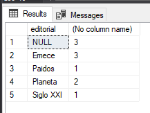
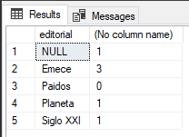
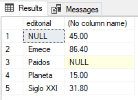
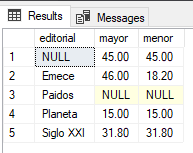
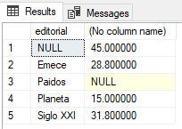
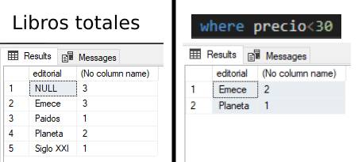
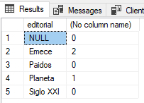

# Explorando la Cláusula `group by` y las Funciones de Agrupamiento

## Funciones de Agrupamiento (`count`, `sum`, `min`, `max`, `avg`)

SQL Server tiene funciones que nos permiten contar registros, calcular sumas, promedios, obteer valores maximos y minimos, las funciones de agregado.

Se pueden usar en una instruccion `select` y combinarlas con la cláusula `group by`.

Todas estas funciones retornan `null` si ningun registro cumple con la condicion del `where`, excepto `count` que en tal caso retorna 0.

La funcion `count()` cuenta la cantidad de registros de una tabla, incluyendo los que tienen valor nulo.

La funcion `sum()`retorna la suma de los valores que contiene el campo especificado.

Para averiguar el valor maximo o minimo de un campo usamos las funciones `max()` y `min()` respectivamente.

La funcion `avg()` retorna el valor promedio de los valores del campo especificado.

### Explicacion y Ejemplos

Ingresemos el siguiente lote de comandos en el SQL Server Management Studio:
```sql
if object_id('libros') is not null
    drop table libros;

create table libros (
    codigo int identity,
    titulo varchar(40) not null,
    autor varchar(30) default 'Desconocido',
    editorial varchar(15),
    precio decimal(5,2),
    cantidad tinyint,
    primary key (codigo)
);
go

insert into libros
    values('El aleph', 'Borges', 'Planeta', 15, null);
insert into libros
    values('Martin Fierro', 'Jose Hernandez', 'Emece', 22.20,200); 
insert into libros
    values('Antologia poetica', 'J.L. Borges', 'Planeta',null,150); 
insert into libros
    values('Aprenda PHP', 'Mario Molina', 'Emece', 18.20, null); 
insert into libros
    values('Cervantes y el quijote', 'Bioy Casares- J.L. Borges', 'Paidos',null,100);
insert into libros
    values('Manual de PHP', 'J.C. Paez', 'Siglo XXI', 31.80, 120);
insert into libros
    values('Harry Potter y la piedra filosofal','J.K. Rowling',default, 45.00,90); 
insert into libros
    values('Harry Potter y la camara secreta','J.K. Rowling', 'Emece', 46.00,100); 
insert into libros (titulo, autor, cantidad)
    values('Alicia en el pais de las maravillas', 'Lewis Carroll',220);
insert into libros (titulo, autor, cantidad)
    values('PHP de la A a la z',default,0);
```

Averiguamos la cantidad de libros usando la funcion `count()`:
```sql
select count(*)
    from libros;
```

Contamos los libros de editorial `"Planeta"`:
```sql
select count(*)
    from libros;
    where editorial='Planeta';
```

Contamos los registros que tienen precio (sin tener en cuenta los que tienen valor nulo):
```sql
select count(precio)
    from libros;
```

Cantidad total de **libros**, sumamos las cantidades de cada uno:
```sql
select sum(cantidad)
    from libros;
```

Para conocer cuantos libros tenemos de la editorial `"Emece"`:
```sql
select sum(cantidad)
    from libros;
    where editorial='Emece';
```

Queremos saber cual es el libro mas costoso:
```sql
select max(precio)
    from libros;
```

Para conocer el precio minimo de los libros de `"Rowling"`:
```sql
select min(precio)
    from libros;
    where autor like '%Rowing%';
```

Queremos sabe el promedio del precio de los libros referentes a `"PHP"`:
```sql
select avg(precio)
    from libros;
    where titulo like '%PHP%';
```

## Agrupar registros (`group by`)

Hemos aprendido que las funciones de agregado tambien permiten realizar varios cálculos operando con conjuntos de registros.

Las funciones de agregado solas producen und valor de resumen para todos los registros de un campo. Podemos generar valores de resumen para un solo campo, combinando las funcaiones de agregado con la clausula `group by`, que agrupa registos para consultas detalladas.

La sintaxis basica es la siguiente:
```sql
select campo, funcion_de_agregado
    from nombre_tabla
    group by campo;
```

### Explicacion y Ejemplos

Queremos saber la cantidad de libros de cada editorial, podemos tipear la siguiente sentencia:
```sql
select count(*) from libros
    where editorial='Planeta';
```
y repetirla con cada valor de 'editorial':
```sql
select count(*) from libros
    where editorial='Emece';
select count(*) from libros
    where editorial='Paidos';
``` 

Pero hay otra manera, utilizando la cláusula `group by`:
```sql
select editorial, count(*)
    from libros
    group by editorial;
```


La instruccion anterior solicita que muestre el nombre de la editorial y cuente la cantidad agrupando los registros por el campo `editorial`. Como resultado aparecen los nombres de las editoriales y la cantidad de registros para cada valor del campo.

Los valores nulos se procesan como otro grupo.

Entonces, para saber la cantidad de libros que tenemos de cada editorial, utilizamos la funcion `count()`, agregamos `group by` (que agrupa registros) y el campo por el que deseamos que se realice el agrupamiento,
tambien colocamos el nombre del campo a recuperar.

Tambien se puede agrupar por mas de un campo, en tal caso, luego del `group by` se listan los campos, separados por comas.

Todos los campos que se especifican en la clausula `group by` deben estar en la lista de seleccion:
```sql
select campo1, campo2, funcion_de_agregado
    from nombre_tabla
    group by compo1, campo2;
```

Para obtener la cantidad de libros con precio no nulo, de cada editorial utilizamos la funcion `count()` enciandole como argumento el campo `precio`, agregamos `group by` y el campo por el que deseamos que se realice el agrupamiento (`editorial`):
```sql
select editorial, count(precio)
    from libros
    group by editorial;
```


Como resultado aparecen los nombres de las editoriales y la cantidad de registros de cada una, sin contar los que tienen precio nulo.

>[!note]
>Recuerde la diferencia de los valores que retorna la funcion `count()` cuando enviamos como argumento un asterisco o el nombre de un campo: en el primer caso cuenta todos los registros incluyendo los que tienen valor nulo, en el segundo, los registros en lso cuales el campo especificado es **no nulo**.

Para conocer el total en dinero de los libros agrupados por `editorial`:
```sql
select editorial, sum(precio)
    from libros
    group by editorial;
```


Para saber el maximo y minimo valor de los libros agrupados por `editorial`:
```sql
select editorial,
    max(precio) as mayor,
    min(precio) as menor
    from libros
    group by editorial;
```


Para calcular el promedio del valor de los libros agrupados por `editorial`:
```sql
select editorial, avg(precio)   
    from libros
    group by editorial;
```


Es posible limitar la consulta con `where`.

Si incluye una cláusula `where`, solo se agrupan los registros que cumplen las condiciones.

Vamos a contar y agrupa por editorial considerando solamente los libros cuyo precio sea menor a 30 pesos:
```sql
select editorial, count(*)
    from libros
    where precio<30
    group by editorial;
```


Note que las editoriales que no tienen libros que cumplan con la condicion, no aparecen en la salida.

Para que aparezcan todos los valores de `editorial`, incluido los que devuelven cero o `null` en la columna de agregado, debemos emplear la **palabra clave** `all` al lado de `group by`:
```sql
select editorial, count(*)
    from libros
    where precio<30
    group by all editorial;
```


Entonces, usamos `group by` para organizar registros en grupos y obtener un resumen de dichos grupos. SQL Server produce una columna de valores por cada grupo, devolviendo filas por cada grupo especificado.