# Descubre cómo usar `distinct` y `top` en SQL Server

## Registros duplicados (`distinct`)

Restringe los valores de la variable de rango actual para eliminar los valores duplicados en cláusulas de consulta posteriores.

Puede usar la cláusula `distinct` para devolver una lista de elementos únicos. La cláusula `distinct` hace que la consulta omita los resultados duplicados de la consulta. La cláusula `distinct` se aplica a valores duplicados para todos los campos devueltos especificados por la cláusula `select`. Si no se especiica ninguna cláusula `select`, se aplica la clausula `distinct` a la variable de intervalo de la consulta identificada en la cláusula `from`. Si la variable de intervalo no es un tipo inmutable, la consulta solo omitirá un resultado de consulta en caso de que todos los miembros del tipo coincidan con un resultado de consulta existente.

### Explicación y Ejemplos

Data necesaria:
```sql

if object_id('libros') is not null
    drop table libros;

create table libros (
    codigo int identity,
    titulo varchar(40),
    autor varchar(30),
    editorial varchar(15),
    primary key (codigo)
);
go

insert into libros
    values('El aleph', 'Borges', 'Planeta');
insert into libros
    values('Martin Fierro', 'Jose Hernandez', 'Emece');
insert into libros
    values('Martin Fierro', 'Jose Hernandez', 'Planeta');
insert into libros
    values('Antologia poetica', 'Borges', 'Planeta');
insert into libros
    values('Aprenda PHP', 'Mario Molina', 'Emece');
insert into libros
    values('Aprenda PHP', 'Lopez', 'Emece');
insert into libros
    values('Manual de PHP', 'J. Paez', null);
insert into libros
    values('Cervantes y el quijote', null, 'Paidos');
insert into libros
    values('Harry Potter y la piedra filosofal', 'J.K. Rowling', 'Emece');
insert into libros
    values('Harry Potter y la camara secreta', 'J.K. Rowling', 'Emece');
insert into libros
    values('Alicia en el pais de las maravillas', 'Lewis Carroll', 'Paidos');
insert into libro
    values('Alicia en el pais de las maravillas', 'Lewis Carroll', 'Planeta');
insert into libros
    values('PHP de la A a la Z',null,null);
insert into libros
    values('Uno', 'Richard Bach', 'Planeta');
```
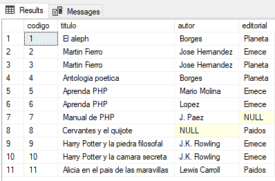

Con la cláusula `distinct` se especifica que los registros con ciertos datos duplicados sean obviadas en el resultado. Por ejemplo, queremos conocer todos los autores de los cuales tenemos libros, si utilizamos esta sentencia:
```sql
select autor from libros;
```
![alt text]images/video-22/(image.png)

Aparecen repetidos. Para obtener la lista de autores sin repeticion:
```sql
select distinct autor from libros;
```
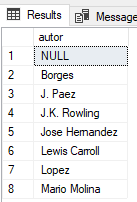

Tambien podemos tipear:
```sql
select autor from libros
    group by autor;
```
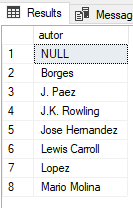

Note que en los tres casos anteriores aparece `null` como valor para `autor`. Si solo queremos la lista de autores conocidos, es decir, no queremos incluir `null`en la lista, podemos utilizar la sentencia siguiente:
```sql
select distinct autor from libros
    where autor is not null;
```
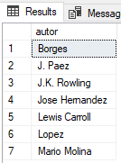

Para contar los distintos autores, sin considerar el valor `null` usamos:
```sql
select count(distinct autor)
    from libros;
```
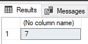

Note que si contamos los autores sin `distinct`, no incluirá los valores `null` pero si los repetidos:
```sql
select count(autor)
    from libros;
```
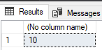

Esta sentencia cuenta los registros que tienen autor.

Podemos combinarla con `where`. Por ejemplo, queremos conocer los distintos autores de la editorial `"Planeta"`:
```sql
select distinct autor from libros
    where editorial='Planeta';
```
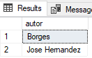

Tambien puede utitlizarse con `group by` para contar los diferentes autores por editorial:
```sql
select editorial, count(distinct autor)
    from libros
    group by editorial;
```
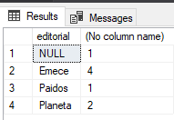

La cláusula `distinct` afecta a todos los campos presentados. Para mostrar los titulos y editoriales de los libros sin repetir titulos ni editoriales, usamos:
```sql
select distinct titulo,editorial
    from libros
    order by titulo;
```
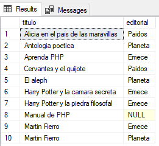

Note que los registros no están duplicados, aparecen títutlos iguales pero con editorial diferente, cada registro es diferente.

Entonces, `distinct` elimina (será que quizo decir "no muestra" en vez de elimina?) registros duplicados.

## Cláusula `top`

La cláusula `top` indica que en el resultado no deben aparecer todas las filas resultantes sino un cierto número de registros, las `n` primeras. Si la consulta incluye la cláusula `oerder by`, se realiza la ordenación antes de extraer los `n` primeros registros.

Cuando se combina con `order by` es posible emplear tambien la cláusula `with ties`. Esta clausula permite incluir en la selección, todos los registros que tengan el mismo valor del campo por el que se ordena en la última posición. Es decir, si el valor del campo por el cual se ordena el ultimo registro retornado (el número `n`) está repetido en los siguientes registros (es decir, el `n+1` tiene el mismo valor que `n`, y el `n+2`, etc.), lo incluye en la selección.

### Explicacion y Ejemplos

Data necesaria:
```sql

if object_id('libros') is not null
    drop table libros;

create table libros (
    codigo int identity,
    titulo varchar(40),
    autor varchar(20),
    editorial varchar (20)
);

go

insert into libros values ('Uno', 'Richard Bach', 'Planeta');
insert into libros values ('El aleph', 'Borges', 'Emece');
insert into libros values ('Alicia en el pais...', 'Carroll', 'Planeta');
insert into libros values ('Aprenda PHP', 'Mario Molina', 'Siglo XXI');
insert into libros values ('Java en 10 minutos', 'Mario Molina', 'Siglo XXI');
insert into libros values ('Java desde cero', 'Mario Molina', 'Emece');
insert into libros values ('Ilusiones', 'Richard Bach', 'Planeta');
```
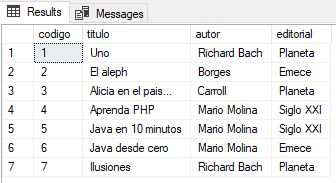
---

La palabra clave `top` se emplea para obtener sólo una cantidad limitada de registros, los primeros `n` registros de una consulta.

Con la siguiente consulta obtenemos todos los datos de los primeros 2 libros de la tabla:
```sql
select top 2 * from libros;
```
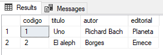

Es decir, luego del `select` se coloca `top` seguido de un número entero positivo y luego continúa con la consulta.

Se puede combinar con `order by`:
```sql
select top 3 titulo, autor
    from libros
    order by autor;
```
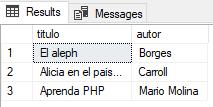

En la consulta anterior solicitamos los títulos y autores de los 3 primeros libros, ordenados por autor.

Cuando se combina con `order by` es posible emplear tambien la cláusula `with ties`. Esta clausula permite incluir en la selección, todos los registros que tengan el mismo valor del campo por el que se ordena en la última posición. Es decir, si el valor del campo por el cual se ordena el ultimo registro retornado (el número `n`) está repetido en los siguientes registros (es decir, el `n+1` tiene el mismo valor que `n`, y el `n+2`, etc.), lo incluye en la selección.

Veamos un ejemplo:
```sql
select top 3 with ties
    * from libros
    order by autor;
```
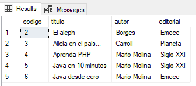

Esta consulta solicita el retorno de los primeros 3 registros; en caso que el registro número 4 (y los posteriores), tengan el mismo valor en `autor` que el último registro retornado (número 3) tambien apareceran en la selección.

Otro argumento posible cuando utilizamos la cláusula `top` es `percent` indicando el porcentaje de registros a recuperar y no la cantidad, por ejemplo:
```sql
select top 50 percent
    * from libros
    order by autor;
```
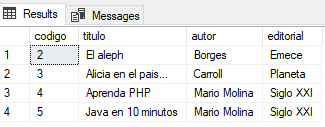

Se recuperan la mitad de los registros de la tabla `libros`.

Los valores fraccionarios se redondean al siguiente valor entero.

Si colocamos un valor para `top` que supera la cantidad de registros de la tabla, SQL Server muestra todos los registros.